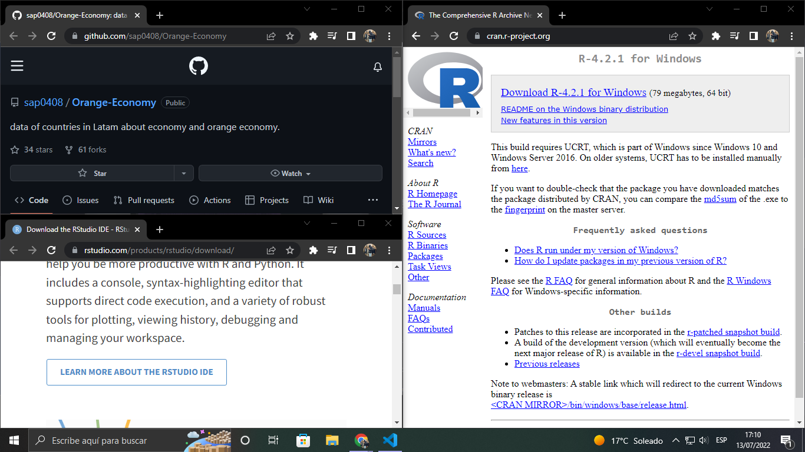
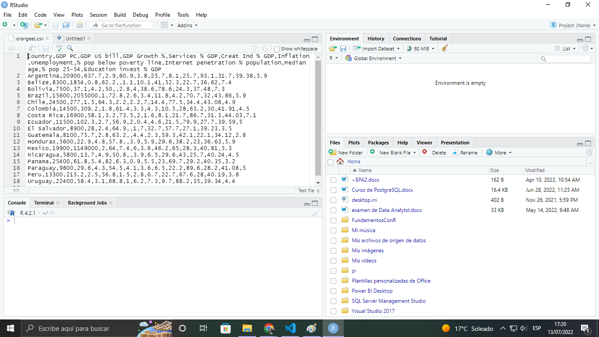
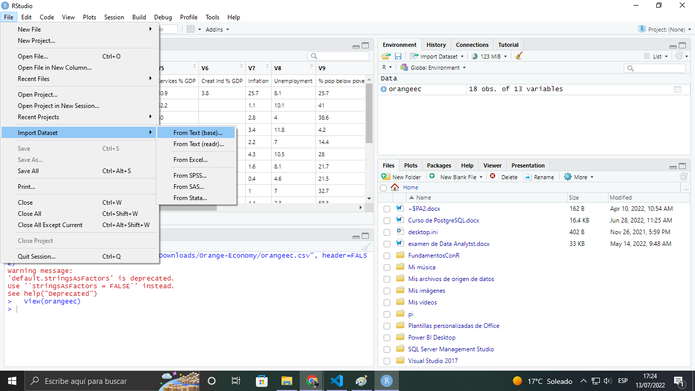
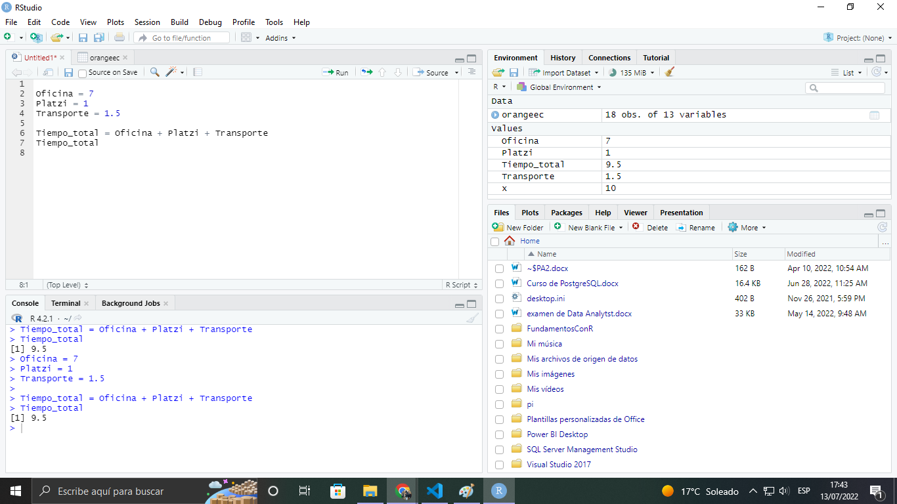
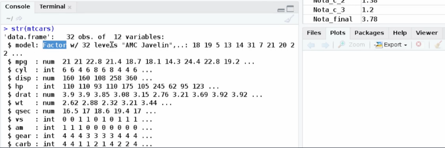
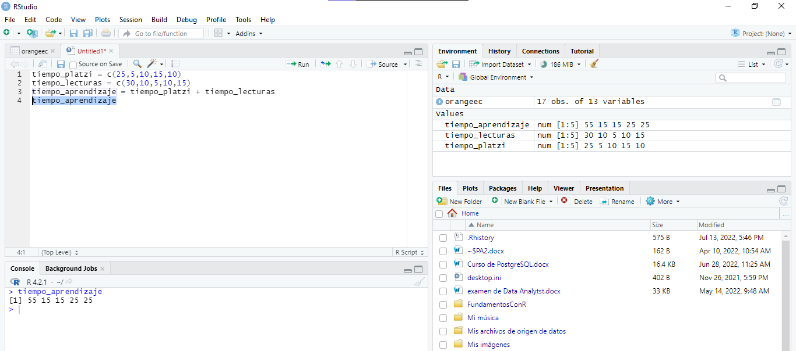
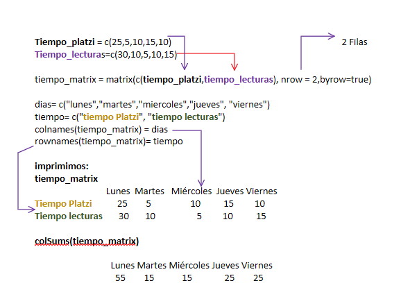

# Curso fundamento con R

- [Instalando nuestras herramientas](#Instalandonuestrasherramientas)
- [Importarachivos](#Importarachivos)
- [Tipos de datos](#Tiposdedatos)
- [Estructura del dataset del proyecto](#Estructuradeldatasetdelproyecto)
- [Vectores](#Vectores)
- [Matrices](#Matrices)
- [Ejercicios con matrices](#Ejerciciosconmatrices)
- [Primero calculos](#PrimerosCalculos)
- [Primero calculos](#PrimerosCalculos)
- [Primero calculos](#PrimerosCalculos)
- [Primero calculos](#PrimerosCalculos)
- [Primero calculos](#PrimerosCalculos)
- [Primero calculos](#PrimerosCalculos)
- [Primero calculos](#PrimerosCalculos)
- [Primero calculos](#PrimerosCalculos)
- [Primero calculos](#PrimerosCalculos)
- [Primero calculos](#PrimerosCalculos)
- [Primero calculos](#PrimerosCalculos)
- [Primero calculos](#PrimerosCalculos)
- [Graficos en R ](#TiposDeGraficos)

## Instalandonuestrasherramientas
- ¿Qué es la economía naranja?
  - Es donde se mezclan las industrias culturales con las áreas de soporte como el desarrollo de aplicaciones o software.

  - Buscaremos responder a la pregunta:
  - Si tienes un startup que hace software, ¿en qué país abrirías una oficina?

  - El dataset de economía naranja fue creado por la profesora con las siguientes variables:

    - Aporte de servicios a PIB.
    - Aporte de economía naranja a PIB.
    - Penetración de internet.
    - Inflación.
    - Tasa de desempleo.
    - Población debajo de la línea de pobreza.
    - Edad mediana de la población.
    - Porcentaje de la población entre 25-54 años.
    - Inversión en educación %PIB.
  - Instalando: 
    - R: https://cran.r-project.org/
    - RStudio: https://www.rstudio.com/products/rstudio/download/
    - OrangeEconomiGithub: https://github.com/sap0408/Orange-Economy

  - 
  - 
## Importarachivos
- Primero importar bien los archivos en Rstudio
  - 
## PrimerosCalculos
- En esta clase vamos a hacer unos cuantos cálculos dentro de R Studio para ir acostumbrándonos a su sintaxis y comandos útiles.

- Dos comandos que utilizaras muy seguidos son:

  - (Ctrl + L): Se encarga de borrar la consola.
  - (Ctrl + Enter): Realiza la operación que selecciones.
  - Asignar un valor a una variable dentro de R se hace mediante el par de signos <- quedando, por ejemplo:

  - x <- 10
  - La función View nos muestra nuestro dataset en forma de tabla.
 - Comandos:
  - View(Orangec) = Vemos la tabla llamada Orangec
  - cotrl + l = se limpia la consola
  - ctrl + enter = para ejecutar 
  - <-  es el signo igual(=) en R
  - Tabien podemos utilizar el = que es el mismo
  - 
## Tiposdedatos
- str(mtcars)   str = estructura
- 
- Para conocer la estructura de un dataset, utilizamos la función str() (que significa structure o estructura), pasandole como parámetro el nombre del dataset en cuestión.
­
- En la información arrojada podemos visualizar los tipos de datos:
- (se recomienda comprender los fundamentos de la programación)
- int: Enteros. Números “redondos” como 1, 2, 3, 10, 100.
- num: Numérico. Números flotantes (o de coma flotante, decimales), como 1.5, 2.3, 3.2, 0.01.
- logi: Booleanos. Valores de true o false
­
- Vale la pena aclarar que en los datasets, los valores booleanos pueden estar representados con los enteros (int) 1 y 0, true o false respectivamente.
Para cambiar el tipo de dato, podemos llamar al dataset, situarnos en la variable, y utilizar el método as.logical().
dataset$var = as.logical(dataset$var)
­
- También vimos la variable Factor, se usa para clasificar los datos según su grupo o categoría.
­
- Hubo dos términos claves, observaciones y variables.
Observaciones: Filas.
  - Variables: Columnas.
  - Donde fila y columna tienen el mismo significado que tienen en una tabla convencional; fila y observación son sinónimos, y variables y columnas también.

##  Estructuradeldatasetdelproyecto
- summary: función que nos va a mostrar un resumen del dataset que le mandemos.
- transform: función para modificar los valores de un dataset.
- View(orangeec)
- str(orangeec)
- ojo: desactivar el heading sino no vamos poder hacer el summary al momento de importar el archivo
- summary(orangeec) nos muestra minimo macimo mediana
- tranformar de libras a kilos:
  - mtcars.new <- transform(mtcard,wt=wt*1000/2)
  - mtcars.new
  - summary(mtcars.new)
## Vectores
- Un vector es un ente matemático que se usa para guardar información de un mismo tipo, dentro de R se crean los vectores con la función c.

  - sum es una función que como su nombre lo indica,retorna la suma de los valores que le indiquemos.
- 
- [Utilizar vectores profesionalmente](/comousarvectoresenR.pdf)
## Matrices
- - 
- Una matriz debe tener mismo tipo de datos, por otro lado, un dataframe puede tener diferentes.
- Para crear una matriz en R utilizaremos la función matrix cuyos argumentos son:

  - la información de los elementos.
  - nrow: número de filas.
  - ncol: número de columnas.
  - byrow: booleano para indicar si llenar la matriz por filas.
  - colSums es una función que por argumento recibe una matriz y te retorna la suma de los valores de sus columnas.
- Las matrices se diferencian de los dataset/dataframes porque tienen el mismo tipo de dato.
-Una matriz es, palabras mas palabras menos, una tabla o un arreglo de dos dimensiones.
- Las matrices en R se crean con la función MATRIX, la cual tiene los siguientes parametros:

  - Data: Se refiere obviamente a los datos con lo que se creará la matriz. En este ejemplo la profesora usa un nuevo vector que recoge los elementos de los dos vectores anteriores, acá les doy un ejemplo:
  - Vector1<-c(1,2,3)
  - Vector2<-c(4,5,6)
  - c(vector1,vector) = 1,2,3,4,5,6
- Se está mezclando los dos vectores anteriores en uno solo
 - Nrow = Se refiere a la cantidad de filas, recuerden que las filas son las horizontales. Es importante tener en cuenta que la función cuenta la cantidad total de elementos de los datos y los divide entre la cantidad de filas que quieras, por lo que si la división no es exacta se repetirán los primeros elementos de los datos
  - En este caso ella escribió para 2 filas, osea que siguiendo el ejemplo de arriba quedaría

    - 1 2 3
    - 4 5 6

  - Si quisieramos dividirlo en 3 filas sería
    - 1 2
    - 3 4
    - 5 6
 - Por último está byrow, se refiere a si se quiere organizar por filas, es decir algo como:
    - 1 2 3
    - 4 5 6
## Ejerciciosconmatrices
- rbind: función para añadir una fila.

- Reto: agrega una columna a nuestra matriz para indicar el día Sabado.

- Para seleccionar rápidamente un elemento de una matriz solamente debemos indicar entre corchetes el número de la fila y de la columna.

## TiposDeGraficos
- Flexdashboard ( para hacer dashbord sencillos)
- RGL ( graficos en 3d)
- Plotly (graficos interactivos)
- leaftlet (mapas)
- RcolorBrewer (manejo y color avanzado)
- Shiny (aplicaciones web)
- https://www.youtube.com/watch?v=bYxjgO2dkXI
